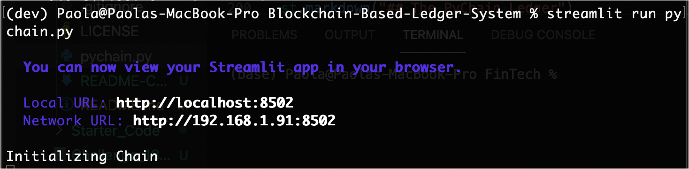
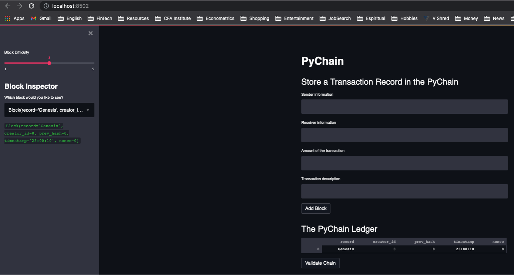
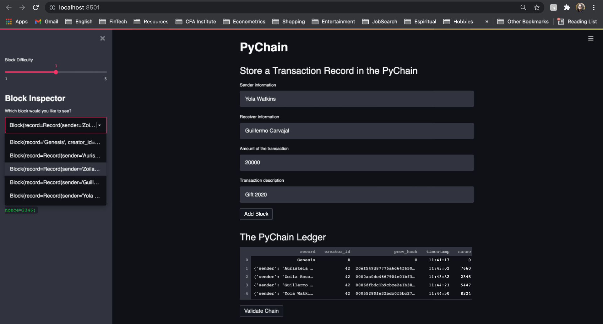
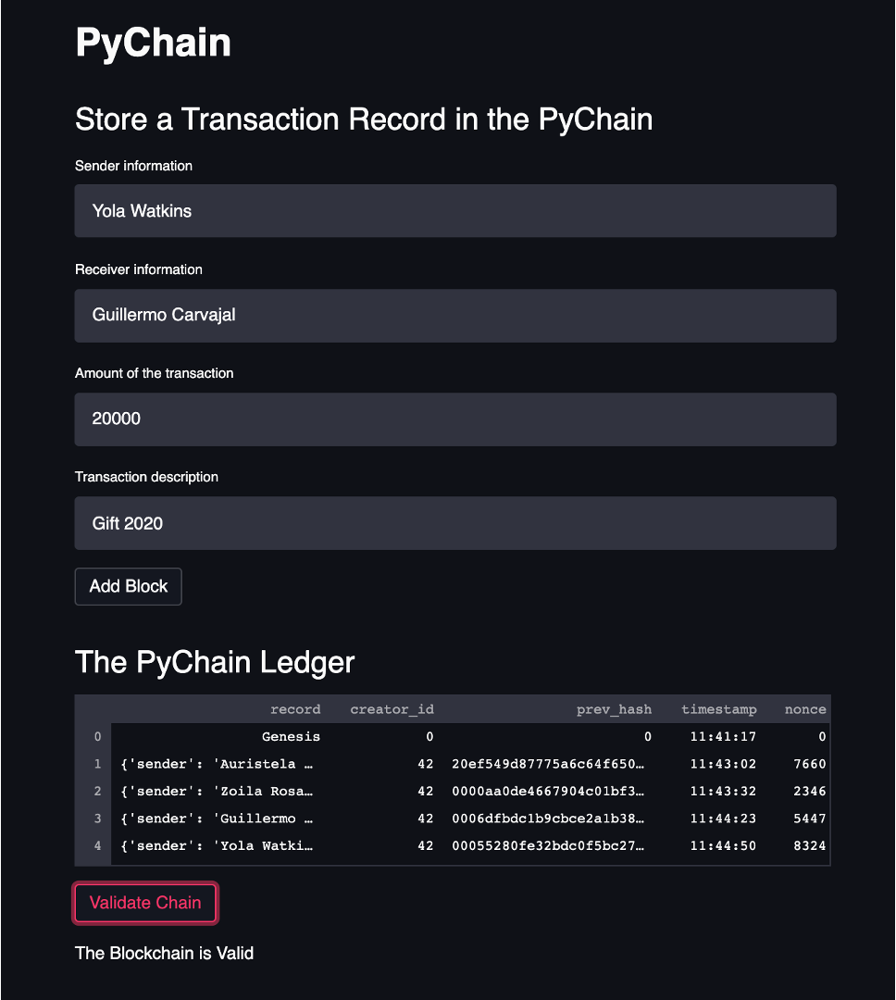
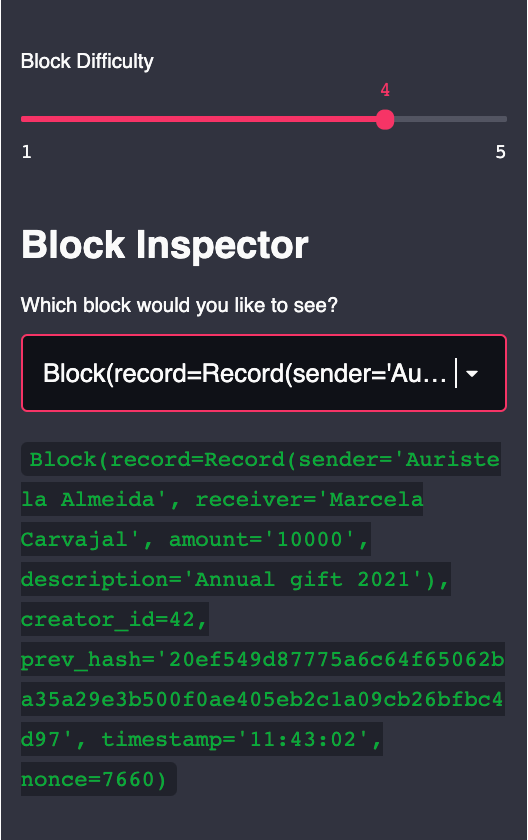

# Blockchain Based Ledger System
This code build a blockchain-based ledger system with a user-friendly web interface. This ledger allows partner banks to conduct financial transactions (that is, to transfer money between senders and receivers) and to verify the integrity of the data in the ledger.

## Technologies
The project uses the following technologies and libraries:

 **Streamlit, Pandas, Hashlib, Dataclasses, Typing, Datetime.**

We used `Python 3.7` in the coding.

## Instalation Guide

If you don't have already, you need to install Pandas and Streamlit. To assure the program will run properly, we recommend versions 1.2.5 for Pandas, and 0.84.2 for Streamlit. If you have other versions, you may want to run the following commands on your terminal:

`pip uninstall pandas -y`

`pip install pandas==1.2.5`

`pip uninstall streamlit -y`

`pip install streamlit==0.84.2`

### Usage

You need to open your terminal or GitBash on the folder of the `pychain.py` file. Then you should run:
    `streamlite run pychain.py`

A local host address will appear. You may be redirected to a page in your browser,  but of not, you may copy and paste directrly the address in yours.

The initial view of an empty ledger will look like the screenshot below, including just a Genesis block on the ledger:

You can do several things with the ledger: 

    1) Store a Transaction Record in the PyChain
    2) Validate the existing records in the chain 
    3) Change the difficulty of the record
    4) See a previous record with the "Block Inspector"
    
Let's see them one by one.

#### 1) Store a Transaction Record in the PyChain
In the main frame, you can add a new block by filling appropiately the text boxes regarding *Sender information*, *Receiver information*, *Amount of the transaction*, and *Transaction description*, and clicking on the **Add Block** button. You can confirm that the record has been stored in the **PyChain Ledger** table, and see the associated hash of the previous block in the chain which validates it and makes it part of the chain, as well as the time that it was included, and the nonce use to obtain a proper hash..

#### 2) Validate the existing records in the chain 
In the main frame, at the bottom, you can validate that the chain is valid by clicking on the **Validate Chain** button, and receiving the message "The Blockchain is Valid".

#### 3) Change the difficulty of a record
Before you store the record, you may change the difficulty in the calculation of the hash by sliding over the sidebar on the left frame, between 1 and 5. In the screenshot below, it is set to 4.

#### 4) See a previous record with the "Block Inspector"

You can select a previous record to inspect its content by selecting it from the dropdown located below the sliding bar. You can see a sample of this functionlity in the previous screenshot, selecting the record timestamped at 11:43:02.

## Contributors
This project was coded by Paola Carvajal Almeida, QuantitativePaola@gmail.com.

Contact email: QuantitativePaola@gmail.com
LinkedIn profile: https://www.linkedin.com/in/paolacarvajal/
GitHub: https://github.com/paocarvajal1912

## License
This project uses a MIT license. This license allows you to use the licensed material at your discretion, as long as the original copyright and license are included in your work files. This license does not contain a patent grant,  and liberate the authors of any liability from the use of this code.

